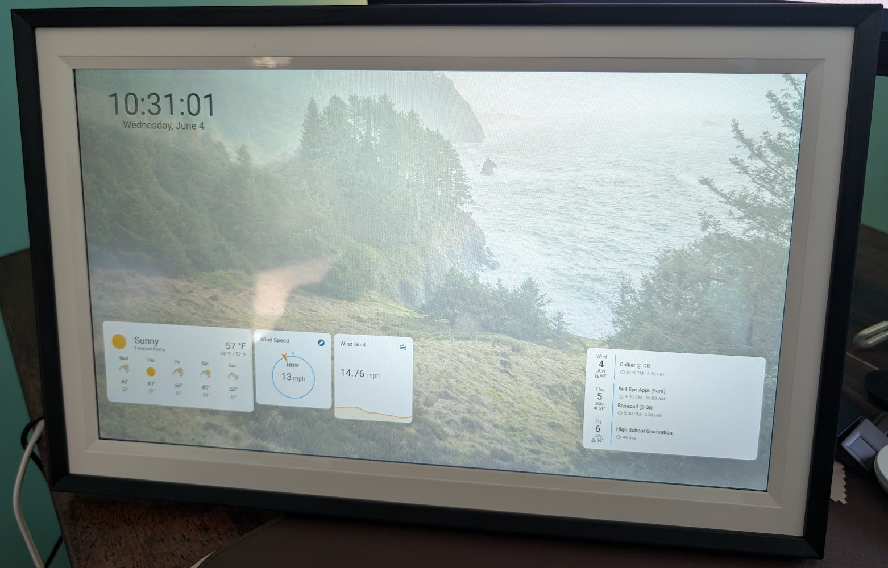

## **Arzopa Photo Frame Dashboard**
This inexpensive android based photo frame makes a simple Home Assistant dashboard with a high Wife Acceptance Factor given it's polished look and feel of a traditional photo frame.

**This process does make changes to the installed operating system, do this at your own risk, it worked for me, doesn't mean it will work for you. Part of the steps involved has risk of bricking your device, proceed with caution and at your own risk!**



[Amazon Link (no affiliate link)](https://www.amazon.com/ARZOPA-Electronic-Mountable-Auto-Rotate-Instantly/dp/B0C13618CH/ref=sr_1_3?crid=2N8Y2PHLQ0M77&dib=eyJ2IjoiMSJ9.L-LGQ6w20uc0Rb1EqoON3voDnSDB_PJgweHgMgaR-p8gZtW5VX7TljL2HBJfKX1bBN2-8P43qoSe3qw7bV541dfIMOJDCckbn1yiKHrYqrrtH60LmGv1fNHgHJ-GHXV_Naze7xybrYcLu12E-Utm-VPqG-4Lldv31-s9MP5MGx3RZJfoRpLvoIo55I2LUO0i_II_yNfZXDBKWX8Al4HV14Sy-i3Ym7dt7fbu-d13tP8.1m78X9TL1H7qosZr2urRM7LNe9138DNs_Ot3HVMarAc&dib_tag=se&keywords=arzopa%2b15%22%2bphoto%2bframe&qid=1749048895&sprefix=arzopa%2b15%2bphoto%2bfra,aps,168&sr=8-3&th=1)

Specs

 - 1080p IPS Display
 - Touchscreen
 - USB-C, SDCard, USB-A
 - Android 8.1 (ugh)
 - RK3326 CPU
 - 1GB Ram (not great, but it works)

Pre-Requisites
- ADB (https://letmegooglethat.com/?q=how+to+setup+adb)
- Download the APKs for
	- FullyKiosk (https://www.fully-kiosk.com/en/#download-box)
	- Bromite WebView (https://www.bromite.org/system_web_view)
	- Minimalist Launcher (https://www.apkmirror.com/apk/digital-minimalism/olauncher-minimalist-and-open-source-2/)
- Optional APK - Wireless ADB enabler (https://apkcombo.com/wadb-wireless-adb-enabler/moe.haruue.wadb/) makes it easier to poke/adjust without having to be tethered to your computer
- Bromite WebView Enabler Overlay (https://github.com/arovlad/bromite-webview-overlay)


# Jailbreaking/Loading FullyKiosk

 1. In the Arzopa/Frameo app settings, enable "Beta Mode", this gives you an option to enable ADB.
 2. Connect your frame to your computer using a USB-A to USB-C cable, I could not get a USB-C to C cable to work, it also will not power directly from the USB port.
 3. You should be prompted to trust your computer when you plug in the cable. If not try un-plugging and re-plugging the cable.
 4. Let's push our APK's to the device
```
adb push app.olauncher_v4.2.2-78_minAPI23(nodpi)_apkmirror.com.apk /sdcard/
adb push Fully-Kiosk-Browser-v1.58.apk /sdcard/
adb push arm64_SystemWebView.apk /sdcard/
adb push WADB-Wireless ADB enabler_7.0.0.r212.65458e8_apkcombo.com.apk /sdcard/
adb push treble-overlay-bromite-webview.apk /sdcard/
```
 4. Let's start a shell session on the device and make the magic happen
``` adb shell
$ su
$ whoami # Verify you are running at root now
root

# Disable the built in photo frame app
$ pm disable net.frameo.frame

# Let's install our APKs
$ pm install /sdcard/app.olauncher_v4.2.2-78_minAPI23(nodpi)_apkmirror.com.apk
$ pm install /sdcard/Fully-Kiosk-Browser-v1.58
$ pm install /sdcard/arm64_SystemWebView
$ pm install /sdcard/WADB-Wireless ADB enabler_7.0.0.r212.65458e8_apkcombo.com.apk 

# Enabled the update of System Webview
$ mount -o rw,remount /vendor
$ mv /sdcard/treble-overlay-bromite-webview.apk /vendor/overlay
$ chmod 0644 /vendor/overlay/treble-overlay-bromite-webview.apk
$ chown root:root /vendor/overlay/treble-overlay-bromite-webview.apk
$ reboot
```

Now assuming everything went smoothly, you should be greeted to a pretty simple generic launcher, you can swipe up from the right side of the screen and select Fully Kiosk. In advanced settings you can change your System Web View to use Bromite as the included webview version if woefully out of date and doesn't allow for updates even when manually installed.

Useful Tip:
When working in Fully Kiosk, there is no on-screen or physical back button, You can use ADB to send the back button:
adb shell input keyevent KEYCODE_BACK
